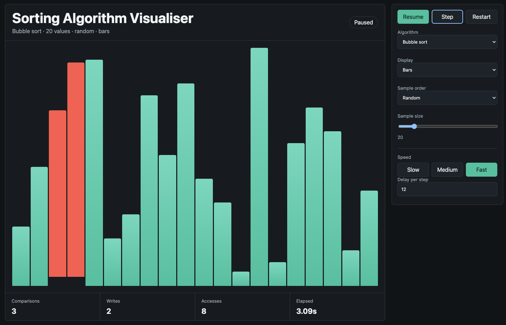
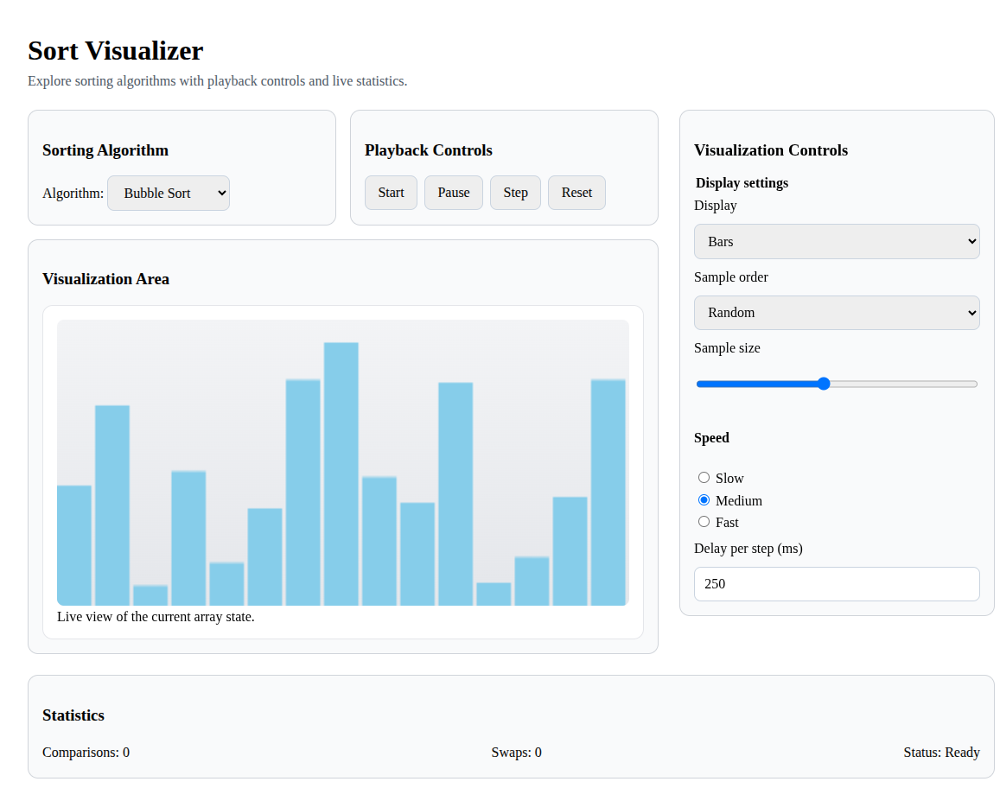
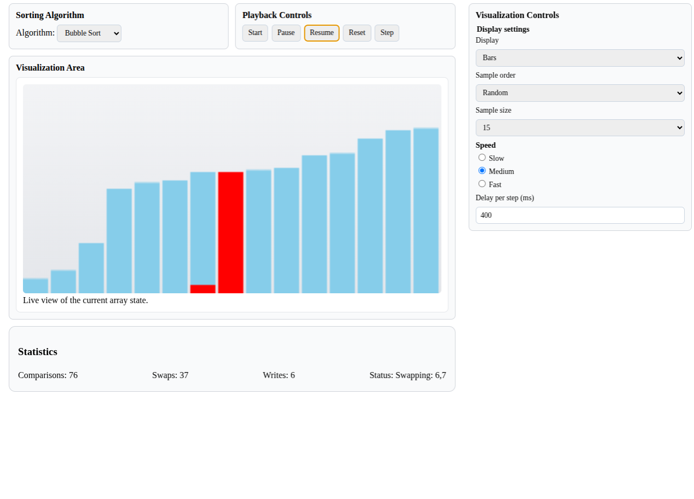
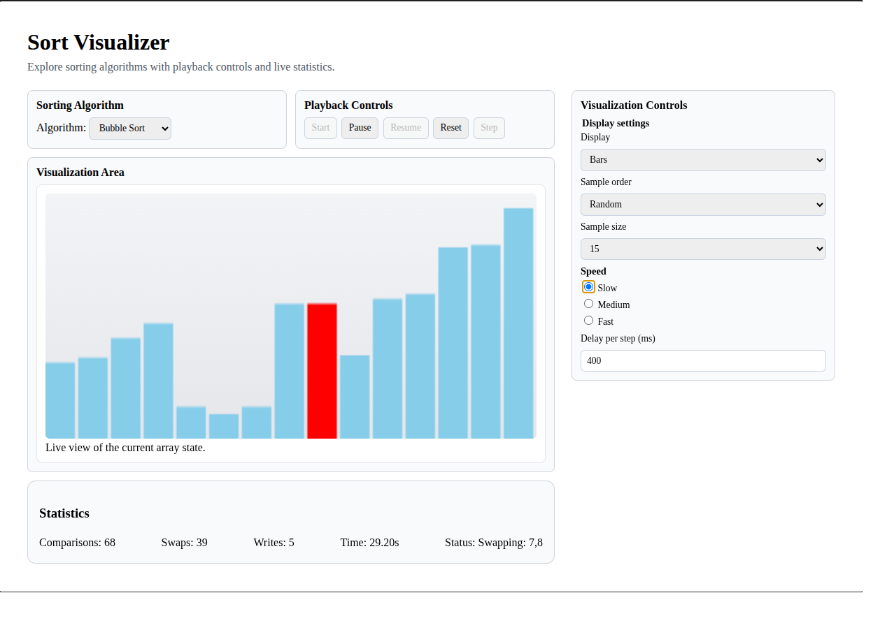
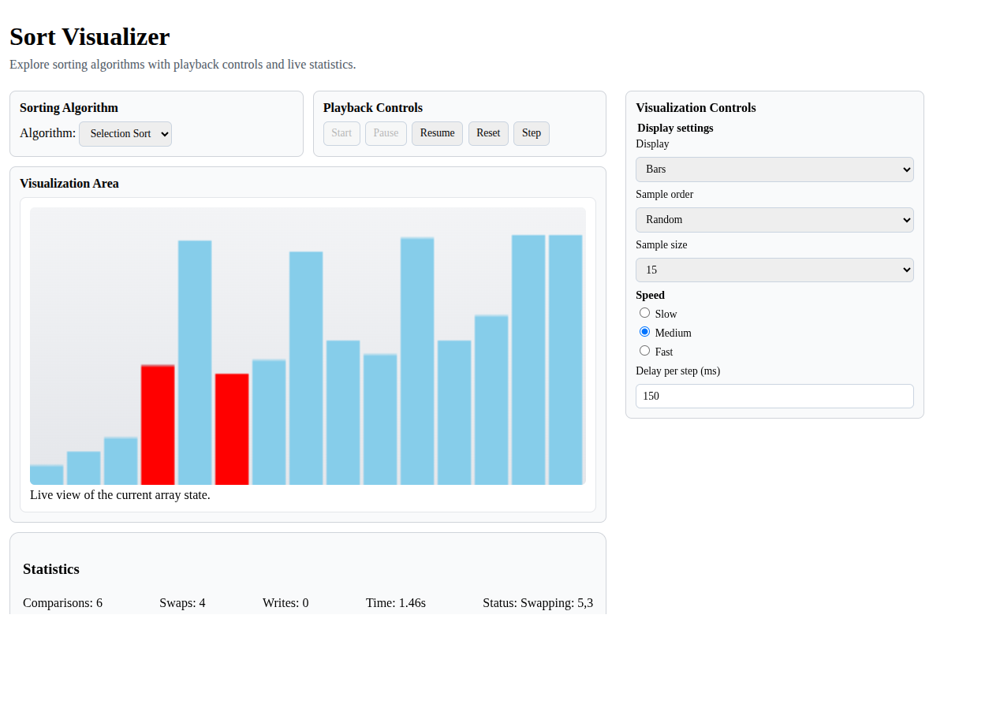

Coding Challenge #130 - Sort Visualiser
This challenge is to build your own tool to visualise how sorting algorithms work.
John Crickett
Aug 08, 2026

# Coding Challenge #130 - Sort Visualiser
This challenge is to build your own sorting algorithm visualiser, a tool that animates how common sorting algorithms operate on an array of values.

Sorting is one of the first topics every programmer meets, and it’s a topic many of us never properly see. We learn that quick sort is faster than bubble sort, that merge sort divides and conquers, that heap sort uses a clever tree structure, but the names blur together until you watch them work.

A visualiser turns each algorithm into a little dance: bars or numbers shuffling, settling, and finally clicking into order. Once you’ve watched insertion sort sweep across a nearly-sorted array, or seen quick sort partition a chaotic mess into neatly halved buckets, the differences between the algorithms become intuitive in a way no Big-O table can match. Building the visualiser yourself is even better, you’ll gain a deep, hands-on understanding of eight classic algorithms and pick up some practical skills around UI rendering, animation timing, and clean abstractions along the way.

**The Challenge - Building Your Own Sorting Visualiser**
In this challenge you’re going to build a tool that animates a sorting algorithm at work on an array of values. By the time you’re done, your tool will support eight classic algorithms: bubble, insertion, selection, merge, quick, heap, shell, and radix. And let the user pick the algorithm, the sample size, the initial order of the data, the display mode, and the animation speed.

Something like this:

You can pick the platform that suits you best. A terminal/CLI implementation (using something like ncurses, blessed, or a similar library) is a great fit if you want to stay close to the keyboard. A browser/web implementation gives you the most flexibility for visuals and is easy to share. A native desktop GUI (using something like Qt, Tauri, GTK, or your language’s standard toolkit) is somewhere in between. Pick the one that interests you every step in this challenge applies to all three.

A small note before we start: you’ll be tempted to just run the algorithm and update the screen at each iteration. That works at first, but quickly tangles your sorting logic with your rendering logic. We’ll structure things so that algorithms produce a stream of events (compared these two indices, wrote this value to that index) and the renderer consumes them. That separation is what’ll make adding new algorithms and new display modes painless later on.

## Step Zero
In this introductory step you’re going to set your environment up ready to begin developing and testing your solution.

Choose your target platform, terminal/CLI, browser/web, or native desktop GUI, and the programming language to go with it. I’d encourage you to pick a stack you’re comfortable with for both UI rendering and handling user input, because you’ll be doing plenty of both.

Have a think about how you’ll handle the animation loop. Most platforms have a natural answer, a render loop tied to the frame rate in a browser or a GUI toolkit, a timed redraw in a terminal. Whichever route you take, you’ll want a way to do work, redraw, and pause for a configurable interval between steps.

## Step 1
In this step your goal is to render an array of values on screen and watch a single sorting algorithm run end-to-end.

Start by generating an array of, say, 30 random integers. Render each value as a vertical bar whose height is proportional to its value, with the bars laid out left-to-right across the screen. Don’t worry about colours, controls, or configuration yet, get the rendering working first.

Now implement bubble sort and animate it. After every comparison and every swap, redraw the array and pause for a short delay (something like 50–100 ms is a good starting point). When the algorithm finishes, the bars should be in ascending order from left to right.

This is your end-to-end skeleton. Everything else in the challenge will hang off this foundation.

Testing: Run your tool and watch the array sort itself. The bars should start in random order and finish in ascending order. Try a few different sample sizes (10, 30, 50) and confirm the layout still looks right. If your bars overflow the screen or look squashed, adjust your scaling so the tallest bar uses most of the available height.

**implementation step1**:

## Step 2
In this step your goal is to highlight what the algorithm is doing right now and show some live statistics.

Up to now your bars have all been the same colour. That makes it hard to see what the algorithm is up to at any given moment. Pick three colours: a resting/idle colour for bars that aren’t being touched, a comparison colour for the two indices the algorithm is currently comparing, and a swap/write colour for indices that are currently being swapped or written. Update your bubble sort so that the right indices are highlighted at the right moment.

Next, add a small statistics overlay somewhere on the screen showing the number of comparisons, the number of swaps/writes, the number of array accesses, and the elapsed wall-clock time. Update these as the algorithm runs so the user can watch the counters tick up.

Finally, when the algorithm finishes, validate that the array is actually sorted. If it isn’t, surface a clear error, this’ll save you a lot of pain later when you’re implementing trickier algorithms and a subtle bug slips in.

Testing: Run your tool and confirm the highlighted bars match what bubble sort is doing, the two compared bars should light up in the comparison colour, and when a swap happens you should see the swap colour. Watch the stats counters and sanity check them: for a small array, count a few comparisons by eye and confirm the counter agrees. At the end of the run, deliberately break the algorithm (e.g. comment out the swap) and confirm your validation catches it.

**implementation at step2**:

## Step 3
In this step your goal is to give the user playback controls and a configurable speed.

Right now the visualisation runs straight through from start to finish with no way to pause or replay it. Add controls that let the user start a run, pause it mid-way, resume from where it paused, restart it from the beginning, and step forward by a single operation at a time. The exact bindings are your call, keys in a terminal, buttons in a GUI, both in a web app.

Add a speed control too. Provide at minimum slow, medium, and fast presets, plus a way to set a custom value. Speed can be expressed as a frames-per-second rate or as a delay-per-step, pick whichever feels natural for your platform.

Make sure your controls remain responsive at all speeds. At the fastest preset, it’s tempting to do many algorithm steps per redraw to keep up, but the user still needs to be able to hit pause and have it actually pause. Test that.

Testing: Start a run, pause it half-way through, and confirm the bars freeze in place with the comparison/swap highlights still visible. Resume and confirm it picks up from where it left off. Hit restart and confirm the array goes back to its original state and the stats reset to zero. Use the step control to advance one operation at a time and watch the comparison/swap highlights move with each press. Try the fast preset and confirm pause still responds promptly.

**implementation at step3**:

Note: the most important change is the state of buttons aligned with events of generator (in sorting).

## Step 4
In this step your goal is to refactor bubble sort behind a clean algorithm interface, then add two more algorithms.

So far your sorting code and your rendering code are probably mixed together. We’re going to separate them. Define an interface for a “sortable run”, something that, given an array, produces a stream of events describing what the algorithm is doing. The two essential events are compared these two indices and wrote this value to that index. A generator (or coroutine, or async iterator, depending on your language) is a natural fit: each yield is one event, and the renderer pulls events out one at a time.

Refactor your bubble sort to fit this interface. Your renderer should now consume events from the algorithm rather than calling sort logic directly. The stats counters become trivial to maintain, every comparison event increments the comparison counter, every write event increments the write counter, and so on.

With the interface in place, add insertion sort and selection sort. Each one should be its own implementation of the interface, with no changes needed to your renderer. Add an algorithm selector to your UI so the user can pick which one to run.

Testing: Run each of the three algorithms on the same input and compare. Bubble sort should swap adjacent elements; insertion sort should sweep one element at a time into its correct place in the sorted prefix; selection sort should make far fewer swaps but lots of comparisons. The stats counters should reflect the differences, selection sort, for example, will show roughly the same number of comparisons as bubble sort but far fewer writes.

**implementation at step4**:

Note: the most important change is about use of an array of functions, one per algorithm, and having a dynamic selection in Main.vue for algo type to run. Controls like "step" are availible.

## Step 5
In this step your goal is to add merge sort, quick sort, and heap sort.

Each algorithm should slot into the same algorithm interface you defined in Step 4. If the interface is right, your renderer shouldn’t need any changes, every algorithm is just a different sequence of comparison and write events.

A small word on merge sort: because it uses an auxiliary array, you’ll need to decide how to represent writes back into the main array. The simplest approach is to emit a write event for each element placed back into the main array during the merge. The user will see the array reform piece by piece as the merges complete, which is exactly the behaviour you want.

Testing: Run each of the three algorithms and watch them. Merge sort should produce the classic “halves coming back together” pattern. Quick sort should show pivots being placed and partitions taking shape. Heap sort should show a chaotic phase (heap construction) followed by an orderly phase (extracting the max from the back of the array). Confirm the correctness check from Step 2 passes for all three on a variety of input sizes.

**implementation at step 5**
Same rules as for step4. Following `PROJECT-GUIDELINES.md` for coherence in code.

## Step 6
In this step your goal is to add shell sort and radix sort.

Radix sort is the odd one out. It’s not comparison-based, it sorts by repeatedly distributing values into buckets based on individual digits. You’ll need to decide how to express what radix sort is doing through your event stream. One approach is to emit write events as values move from the array into the buckets and back. Another is to extend your event vocabulary with something like a bucketed this value event. Either is a reasonable design choice, the goal is for the viewer to be able to see the algorithm working.

Testing: Run shell sort and watch how the array goes from chaotic to “fairly ordered” to fully sorted as the gap shrinks. Run radix sort on a fixed-width integer array and confirm it sorts correctly. Compare radix sort’s stats counters to the comparison sorts, radix sort should have zero comparisons (or very few, depending on how you count) and a number of writes proportional to the number of digits times the array size.

**implementation at step 6**
Same rules as for step4-5. radix sort is a new kind of algorithm and does not use swap and comps.

## Step 7
In this step your goal is to add the numbers display mode behind a pluggable rendering interface.

Up to now everything has been bars. The numbers display mode renders each value as a small labelled tile or box showing the numeric value, laid out in a row. When two indices are being compared or swapped, the corresponding tiles should be visually lifted or separated from the main row so the active operation is unambiguous, with the comparison/swap colours from Step 2 applied.

Just as you separated algorithms from rendering in Step 4, now separate the bars renderer from a generic rendering interface. Each renderer should accept the same array and event stream and decide how to draw it. Adding the numbers renderer should not require changes to any of the algorithms.

Add a display mode selector to your UI so the user can switch between bars and numbers.

Testing: Run each of your eight algorithms in numbers mode and confirm the lift behaviour matches what you expect, when bubble sort compares two adjacent elements, those two tiles should lift; when it swaps them, both should be highlighted in the swap colour. Switch between bars and numbers mid-run if you can; the algorithm should keep running and just the rendering should change.

## Step 8
In this step your goal is to add sample size and sample order configuration, polish the user experience, and finish the documentation.

Add controls that let the user select the sample size (the number of elements in the array, with sensible minimum and maximum bounds for your platform) and the initial sample order. Support at least three orders: random, reversed, and already sorted. When the user restarts a run, regenerate a fresh sample of the configured size and order, except for already sorted, which is deterministic by definition. This means consecutive runs of the same algorithm exercise different inputs.

Show the current configuration on screen at all times: the chosen algorithm name, the sample size, the sample order, and the display mode. The user should never have to wonder what they’re looking at.

When a sort completes, present a clear “sorted” state. A nice touch is a final sweep through the array, a brief animation where each element is briefly highlighted in turn, left to right, to confirm visually that everything is in order. Freeze the final stats so the user can read them.

Finally, write a short README documenting how to run your tool, how to choose between platforms (if you’ve implemented more than one), and, importantly, how a future contributor would add a new algorithm or a new display mode. If your interfaces from Steps 4 and 7 are clean, this should be easy to write. If it’s hard to write, that’s a signal that the interfaces could be better.

Testing: Try every combination of configuration: each algorithm, each sample size from your minimum to your maximum, each sample order, each display mode. Confirm the on-screen configuration always matches what you’ve selected. Confirm that two consecutive runs of bubble sort with random order produce different starting arrays, but two consecutive runs with already sorted order produce the same one. Watch the completion sweep at the end of a run and confirm the stats freeze on the final values. Hand your README to a friend and ask them to add a hypothetical “cocktail sort” algorithm; if they can do it without reading your renderer code, you’ve nailed the abstraction.

### Going Further
Here are some ideas to take your sorting visualiser further:

Add more algorithms: cocktail sort, comb sort, gnome sort, Tim sort, intro sort, or even bogo sort for fun.

Add a head-to-head mode that runs two algorithms side-by-side on the same input array, so the user can race them.

Add an export-to-video or export-to-GIF option so users can share their favourite runs.

Build an algorithm-comparison view that runs every algorithm across a range of sample sizes and plots comparisons or writes against input size, giving a visual confirmation of each algorithm’s Big-O behaviour.

Visualise additional algorithm-specific metadata: recursion depth for merge and quick sort, the heap structure for heap sort, or the gap sequence for shell sort.
